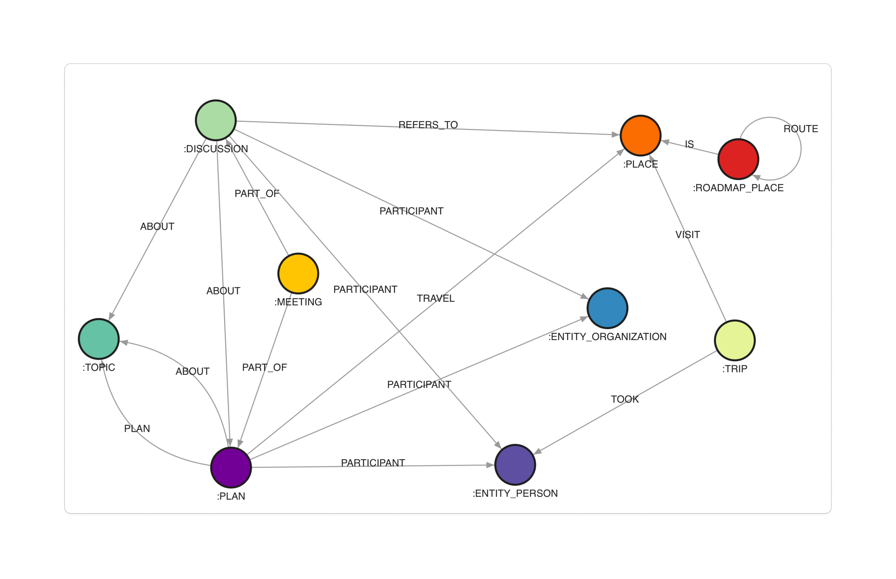

# BAIT: Bias Analytics & Investigation Tool

**VAST Challenge 2025 - Mini-Challenge 2 Submission**

<p align="center">
  
  
</p>

<p align="center">
  
  
  
  
  
  
  
  
</p>

<p align="center">
  
</p>

This repository contains the submission for the VAST Challenge 2025, [Mini-Challenge 2](https://vast-challenge.github.io/2025/MC2.html). The project is a web-based visual analytics tool designed to help a journalist investigate accusations of bias within a government oversight board.

## 🌐 Live Demo

A live demo of the application is running at: **[https://bait.ava25.dbvis.de/](https://bait.ava25.dbvis.de/)**

## 📖 About the Project

The town of Oceanus is experiencing economic shifts, with a growing tourism industry challenging the traditional fishing-based economy. The **Commission on Overseeing the Economic Future of Oceanus (COOTEFOO)** is tasked with monitoring these changes. However, it faces accusations from two opposing groups:

- **Fishing is Living and Heritage (FILAH)**: Accuses COOTEFOO of favoring tourism and neglecting the fishing industry.
- **Tourism Raises OceanUs Together (TROUT)**: Accuses COOTEFOO of being biased towards the entrenched fishing industry.

A journalist, Edwina Darling Moray, is investigating these claims and has acquired datasets from both groups, as well as a more comprehensive dataset of her own. This project provides her with a visual analytics tool to explore these datasets, identify biases, and uncover the truth behind the accusations.

## ✨ Features

- **Bias Scale**: Visualize committee bias with a tipping scale metaphor based on sentiment analysis.
- **Comparative Analysis**: Compare FILAH, TROUT, and journalist datasets side-by-side to reveal sampling bias.
- **Dynamic Industry Pairing**: Automatically identify and visualize the most polarized industries using cosine similarity.
- **Individual Activity Analysis**: Use a Parallel Coordinate Plot to track and compare member activities across datasets.
- **Network Exploration**: Investigate entity relationships with an interactive Ego Network graph.
- **Geospatial & Temporal Views**: Analyze travel patterns through an integrated timeline and map.

## 💻 Technical Implementation

The project is a full-stack web application composed of a Python backend and a Vue.js frontend.

### Backend

- **Data Processing**: A Python script (`load_data.py`) cleans and repairs the JSON datasets.
- **Database**: Data is stored in a Neo4j graph database for efficient relationship querying.
- **API**: A FastAPI server provides data to the frontend.
- **Containerization**: The backend is containerized using Docker for easy deployment.

### Frontend

- **Framework**: A single-page application built with Vue 3 and TypeScript.
- **State Management**: Pinia is used for centralized state management.
- **Visualizations**: D3.js is used for interactive visualizations.
- **Styling**: Tailwind CSS is used for styling.
- **Build Tool**: Vite provides a fast development experience.

## 📊 Data Model

The data is represented as a knowledge graph. The full data model is described in the official VAST Challenge documentation.

<p align="center">
  
</p>


## 🚀 Getting Started

### Prerequisites

- Docker and Docker Compose
- (Node.js and npm)

### Installation

1. **Clone the repo**
   ```sh
   git clone https://gitlab.dbvis.de/ava2025/group-2.git
   ```
2. **Start Containers**
   - Navigate to the `vast-challenge` directory.
   - Start the containers:
     ```sh
     docker-compose up --build
     ```
     or alternatively
     ```sh
     docker compose up --build
     ```

**Troubleshooting**

In case the frontend is unable to load correctly:

   - Navigate to the `vast-challenge/frontend` directory.
   - Install dependencies:
     ```sh
     npm install
     ```
   - rebuild the frontend service & start again:
      ```sh
      docker compose build --no-cache frontend
      docker compose up
      ```

The application will be available at `http://localhost:5173`.

## 🔑 Accessing the Services

- **Frontend Application**: `http://localhost:5173`
- **Backend API Docs**: `http://localhost:8080/docs`
- **Backend Health Check**: `http://localhost:8080/health`
- **Neo4j Browser**: `http://localhost:7474/browser/`

### Neo4j Database Credentials

- **User**: `neo4j`
- **Password**: `ava25-DB!!` (as defined in `docker-compose.yml`)

## 👥 Authors

- **Paul Müller**: `paul.mueller@uni-konstanz.de`
- **Tilio Schulze**: `tilio.schulze@uni-konstanz.de`
